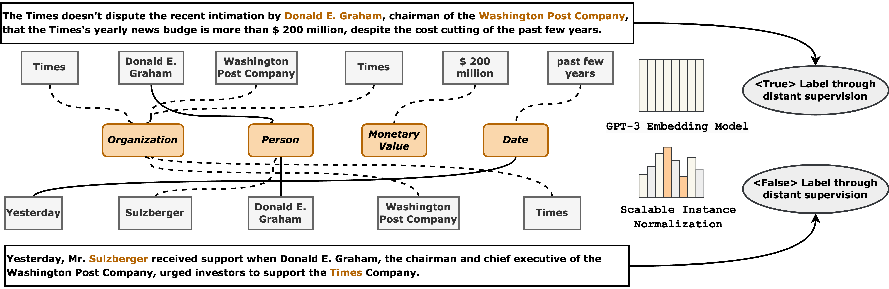

<div align="center">
<h1>Triple-d: Denoising Distant Supervision for High-quality Data Creation</h1>

[](https://github.com/DAISYzxy/Triple-d)
[](https://github.com/DAISYzxy/Triple-d/issues)
[](https://github.com/DAISYzxy/Triple-d/pulls)
[](https://github.com/DAISYzxy/Triple-d/stargazers)
[](https://github.com/DAISYzxy/Triple-d/blob/main/LICENSE)
[](https://github.com/DAISYzxy/Triple-d)
</div>



In this paper, we introduce Triple-d, a denoising distant supervision technique designed to create high-quality data. This method involves adaptive pattern replacement in input instances and further denoising using a non-parametric model with scalable instance normalization. Specifically, we formulate the adaptive pattern replacement task as a maximum-profit bipartite graph problem, determining which entity should be replaced in the input. Edge profits are assigned through its statistical distribution, and we propose an approximation algorithm as a solution. To address the lack of ground truth, we employ a greedy algorithm with a K-Means strategy and introduce instance normalization to enhance the performance of decision boundary instances. Additionally, we optimize the bottleneck full neighbors retrieval algorithm to $\mathcal{O}(N\log N)$ in the non-parametric denoising model, which consists of three building blocks. Extensive experiments on real-world datasets demonstrate the effectiveness and efficiency of our proposed method, Triple-d.


# Contents

- [Installation](#installation)
- [Test](#test)

# Installation
To install the cutting edge version of `Triple-d` from the main branch of this repo, run:
```bash
git clone https://github.com/DAISYzxy/Triple-d.git
cd Triple-d
pip install -r requirements.txt
```
To download the test data including 25% noise (75% True Label) experiments, open the [Google Drive link](https://drive.google.com/file/d/17w2LXIynHJ845qUVG2m7WFTKmzqxiV5P/view?usp=sharing).


# Test
Test the performance of Triple-d, run:
```bash
python main.py \
    --test_path ./data/test_religion75.csv
```
